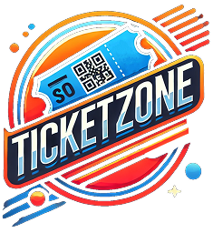

<p align="center">
  
</p>

**TicketZone** es una aplicación móvil desarrollada en Flutter cuyo objetivo principal es ofrecer a los usuarios una experiencia rápida y sencilla para explorar, filtrar y comprar entradas para eventos reales proporcionados por la API de [Ticketmaster](https://www.ticketmaster.com).

---

## 📱 Funcionalidades principales

- 🔍 Buscar y filtrar eventos por categorías.
- 📍 Visualizar ubicación del evento mediante Google Maps (con ruta desde un punto base del país).
- 🛒 Simular compra de entradas y redirección al sitio web de Ticketmaster.
- 🎫 Visualización de boletas simuladas.
- 👤 Registro, login y perfil con datos básicos del usuario.
- 👮 Modo Supervisor para escanear y validar QR generados al simular compras.

---

## 🧩 Tecnologías y herramientas utilizadas

| Tecnología         | Descripción                                                                 |
|--------------------|-----------------------------------------------------------------------------|
| **Flutter**         | Framework principal de desarrollo móvil multiplataforma.                   |
| **Riverpod**        | Gestión de estado reactiva.                                                 |
| **GoRouter**        | Gestión de navegación declarativa.                                          |
| **PostgreSQL (Neon)** | Base de datos alojada en la nube con [Neon](https://neon.tech).        |
| **Google Maps**     | Integración para ver ubicación del evento y calcular rutas.                |
| **Ticketmaster API**| Fuente oficial de eventos reales.                                          |
| **QR Flutter**      | Generación de códigos QR para compras simuladas.                           |
| **Mobile Scanner**  | Escaneo de QR para validación por parte del supervisor.                    |

---

## 🔐 Roles de usuario

- **Usuario general**
  - Registro e inicio de sesión.
  - Exploración, búsqueda y filtrado de eventos.
  - Simulación de compra de entradas.
  - Visualización de boletas compradas.
  - Perfil con nombre, correo y boletas compradas.

- **Supervisor de eventos**
  - Ingreso a través de login especial.
  - Escaneo de códigos QR.
  - Verificación del estado del QR: válido, ya utilizado o inexistente.

---

## 🧪 Simulación de pagos

> ⚠️ **TicketZone NO realiza pagos reales.**  
> Al presionar el botón **"Comprar"**, el usuario será redirigido a la página oficial de Ticketmaster donde podrá completar la compra real de forma segura.

Esta función permite al usuario explorar eventos, simular la compra y finalizarla externamente, garantizando una experiencia realista y sin requerir pasarela de pago integrada.

---

## 🧱 Arquitectura del Proyecto

La aplicación sigue una estructura basada en **Clean Code**, separando las responsabilidades por capas para mejorar el mantenimiento y escalabilidad del proyecto.


```plaintext
lib/
├── 🛠️ config/
│   ├── 🌐 environment/       # Variables como API keys
│   ├── 🧭 router/            # Navegación y rutas (GoRouter)
│   └── 🎨 theme/             # Temas y estilos globales
│
├── 🧠 domain/
│   ├── 📡 datasources/       # Contratos de las fuentes de datos
│   ├── 📦 entities/          # Entidades puras del dominio
│   └── 🧾 repositories/      # Interfaces de repositorios
│
├── 🏗️ infrastructure/
│   ├── 📡 datasources/       # Implementaciones de las fuentes de datos
│   ├── 🧩 models/            # Modelos de datos y mapeo
│   └── 🧾 repositories/      # Implementaciones de repositorios
│
├── 🎬 presentation/
│   ├── 🕵️‍♂️ delegates/        # Delegados para búsqueda
│   ├── 🧰 helpers/           # Utilidades específicas de UI
│   ├── 📦 providers/        # Estado (Riverpod)
│   ├── 📱 screens/          # Pantallas principales
│   ├── 🪟 views/            # Subvistas reutilizables
│   └── 🧱 widgets/          # Componentes UI generales
│
└── 🔁 shared/
    └── 📂 data/             # Recursos compartidos globales

```
Esta arquitectura permite escalar nuevas funciones sin comprometer la estabilidad del código base y facilita el trabajo en equipo al mantener una estructura predecible y ordenada.

---